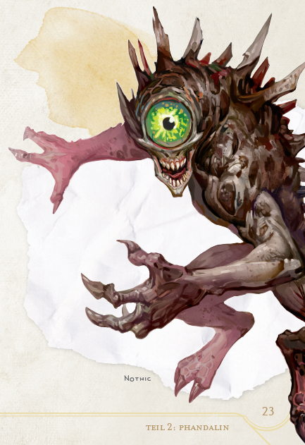
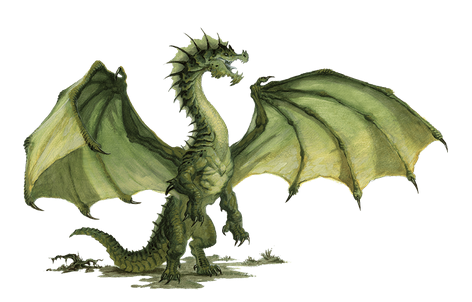
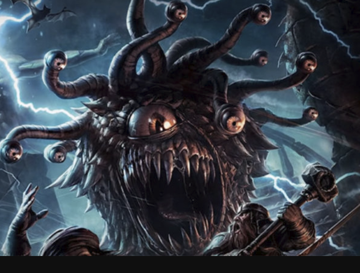
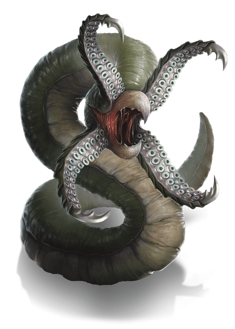
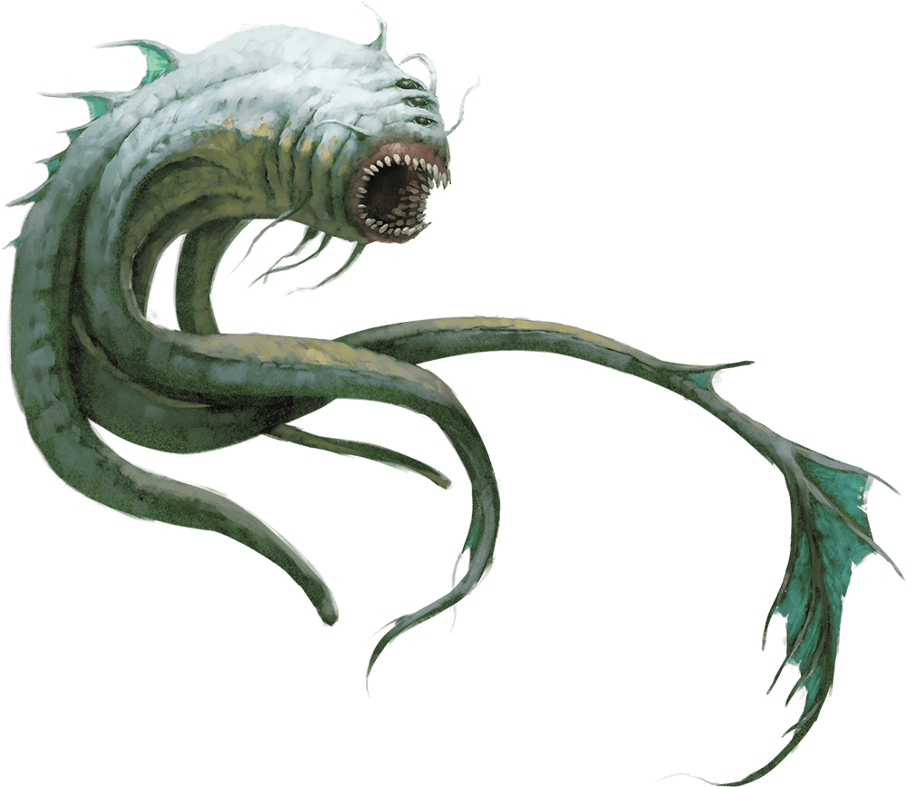

## Nothic
- Bewacht einen Schatz in der Tresendar Villa
- Kann einen verfaulten Blick anwenden -> macht viel Schaden

---
## Vanomfang
- Grüner Drache
- Sprache: `common`
- Sind zutiefst böse -> greifen auch friedliche Seelen an
- Kann Luft und Wasser atmen
- Leben oft in alten Wäldern
- Immun gegen Gift
- Teil sehr viel Giftschaden aus
- Donerbraum (nicht mehr aktuell)
	- Lebt in einem Turm in Donerbraum (hat vermutlich 140-150 Leben)
	- Alle 5-6 Runden kann er einen Giftangriffen welcher maximal 72 Schaden pro Spieler zufügt

---
## Beobachter
- Beschützt Gegenstände
- Stirbt wenn es erblindet (z.B. weil ein Pfeil das Mitte des Auges getroffen hatte)
- Sprache: `common`

---
## Gargoyle
- Resistenz gegen nicht magische Waffen
- Immun gegen Gift
- Wenig Rüstung
- Chaotic evil

---
## Flamenschädel
- Kann einen Feuerball casten
- Braucht circa 1 Stunde um wieder volles Leben zu kriegen
- Der Schädel kann mit Weihwasser getötet werden

---
## Grick
- Kann Wände hochklettern

---
## Aboleth
- Tiefseemonster
- Kann einen Tale Swipe Angriff durchführen

---
## Eisriesen 
- Immun gegen Frostschaden
- 15 trifft
- Schwächer als Feuerriesen
![[Eisriesen.png]]
---
## Feuerriesen
- Immun gegen Feuerschaden
- 18 trifft
![[Feuerriesen.png]]
---
## Fire Elemental
- Immunity: Fire, Poison
