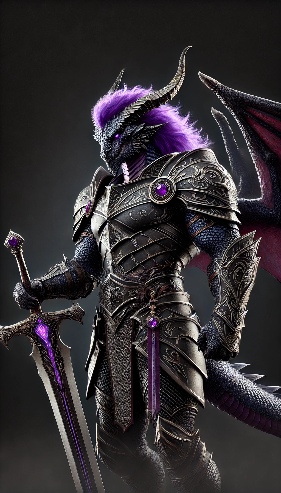
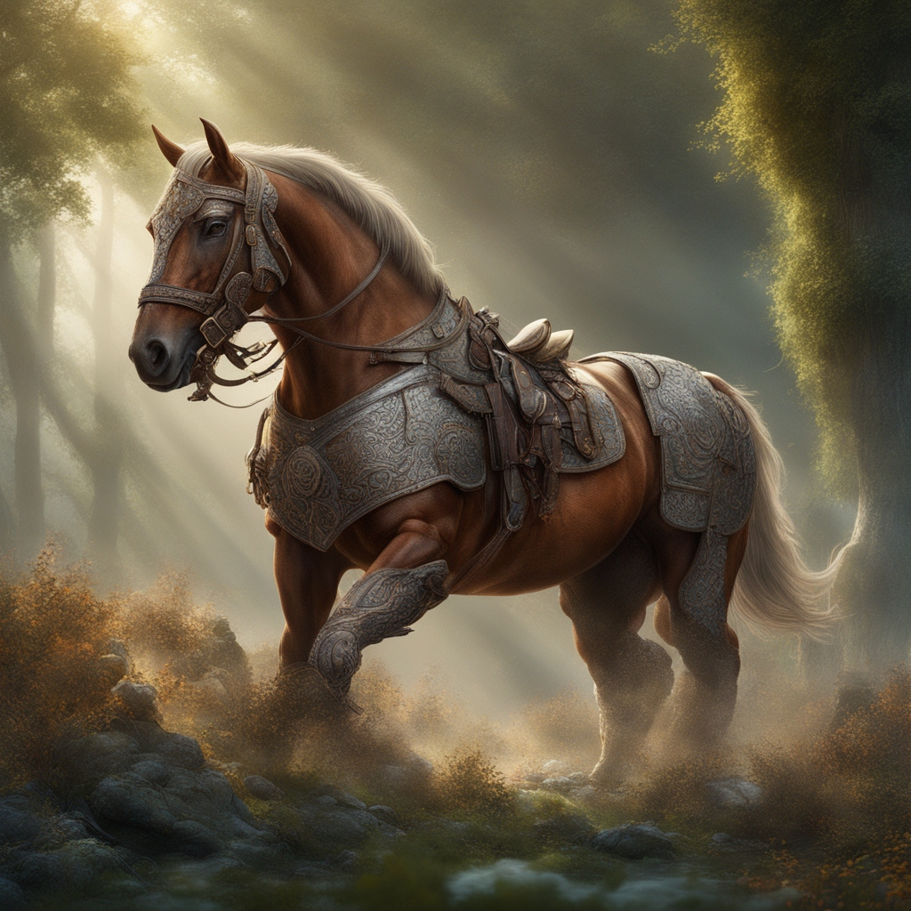

## Ander Thorngage (Johannes)
- Paladin
- 
- [Staff of Charming](Effekte/Ausrüstung#Staff%20of%20Charming) 
- [Weapon of Warning](Effekte/Ausrüstung.md#Weapon%20of%20Warning) 
- Fluch des Werbären

---
## Kriv (Steven)
- [Belt of dwarven kind](Effekte/Ausrüstung#Belt%20of%20dwarven%20kind) 
- Fluch des Werbären

---
## Sindrir "Gremlin" Gerrick (Johnny)
- Artificer
- Rock Gnome
- Auf der Suche nach antiken technischen Geheimnissen. Auf der Suche nach verlorenem wissen um seiner Familie zu beweisen das er zu gebrauchen ist.
- [Gem of seeing](Effekte/Ausrüstung#Gem%20of%20Seeing) 
- 
---
## Amber Ironfist (Luisa)
- 
- [Ring of Jumping](Effekte/Ausrüstung.md#Ring%20of%20Jumping) 
#### Schriftrollen
- 1x Lightning Bolt
- 1x Nebelschritt
- 1x Charme Person

---
## Thokk (Benji)
- 
- [Bracers of Archery](Effekte/Ausrüstung.md#Bracers%20of%20Archery) 
- [Staff of Magic Missile](Effekte/Ausrüstung#Staff%20of%20Magic%20Missile) 
- Fluch des Werbären
#### Schriftrollen
- 1x Nebel
- 1x Blitz

---
## Simus (Dominic)
- Cleric (Nature)
- Hat sein bisheriges Leben im Wald, unter dem Schutz von Mielikki der Göttin der Wälder verbracht. Nach dem Angriff Unbekannter Personen war er gezwungen seine Heimat zu verlassen. Nun versucht er Kameraden zu finden um herauszufinden was an diesem Tag im Wald geschehen ist.
- [Cloak of Displacement](Effekte/Ausrüstung.md#Cloak%20of%20Displacement) 
- [Bag of Holding](Effekte/Ausrüstung#Bag%20of%20Holding) 
- 
#### Bag of Holding
- Riesen Großschwert (200pd)
- Rod of the Vonindod (100pd)
- Schaukelstuhl (10pd)
- Türe (10pd)
- 20 Rationen (40pd)

---
## Silver (Lukas)
- Barde

---
## Boris
- Treuer Begleiter 

