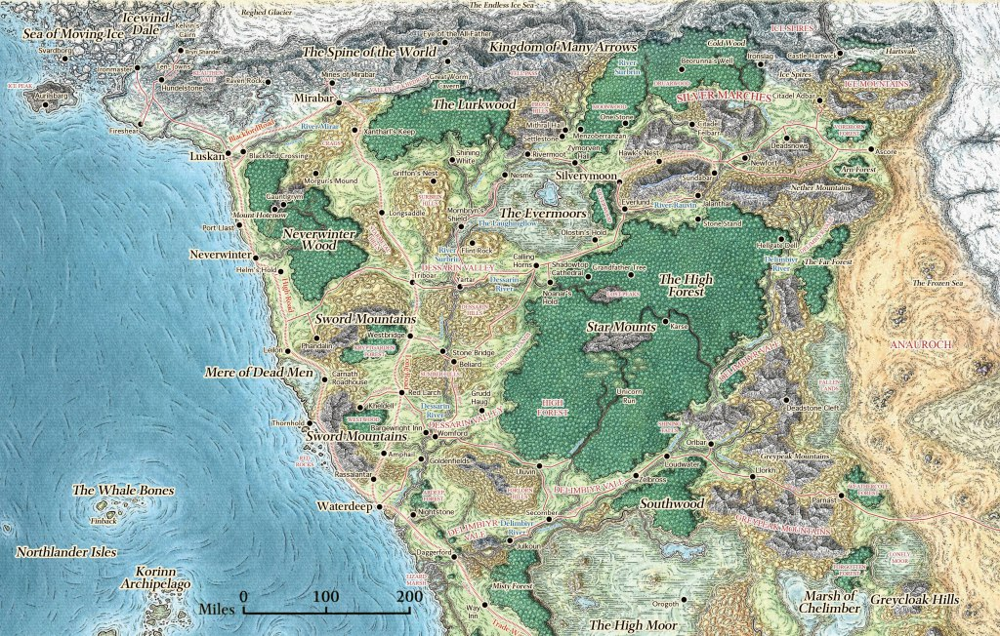

## Dorf - Phandalin 
Ein kleines Dorf mit einer alten zerfallenen Villa -[Tresendar Manor](Tresendar%20Villa.md)- wo sich die Gruppe niedergelassen hat. Geleitet wird das Dorf vom Rat der Adeligen und Reichen.

## Die Mine
- 6k GP gezahlt 
- 10% vom Gewinn der Mine
- 1% vom Gewinn für das Waisenhaus
- 300-1500GP pro Monat (30 Tage)
- Die Mine hat Tag 124 Angefangen zu Produzieren

## Dreiebersdorf
Handelssiedlung an einer Straßenkreuzung. Flaches fruchtbares Land mit kleinen Anhöhen. 

Alle sechs NPCs haben Quests und Belohnungen
