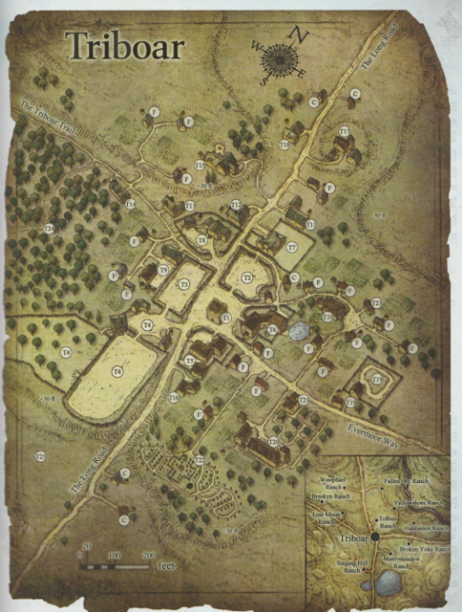
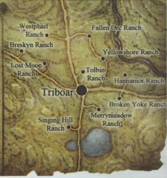

## Dorf - Phandalin 
Ein kleines Dorf mit einer alten zerfallenen Villa -[Tresendar Manor](Tresendar%20Villa.md)- wo sich die Gruppe niedergelassen hat. Geleitet wird das Dorf vom Rat der Adeligen und Reichen.

## Dreiebersdorf
Handelssiedlung an einer Straßenkreuzung. Flaches fruchtbares Land mit kleinen Anhöhen. 

Alle sechs NPCs haben Quests und Belohnungen

## Silverymoon
- Die Stadt ist von sehr mächtiger Magie beschützt
- Es ist eine Stadt der Harper
- Die Reputation hat ein wenig gelitten wegen da sie bei War of the Thunderbar nicht unterstützt haben
- Juwel des Nordens, sie ist einer der schänsten Städte der Schwertküste
- Zentrum von Wissen und Magie
- Politik: wird von einem Rat regiert und an der Spitze ist der High Mage
- Die Stadt ist sehr tolerant, respektvoll gegenüber allen Rassen und der Magie im Alltag
